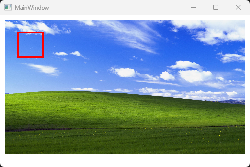

# Astra

A simple Windows Presentation Framework (WPF) GUI to test out new GUI features in C#.

Base GUI is referenced from [here](https://github.com/bemehiser/cmake_csharp_example).

This is how the GUI looks like:

